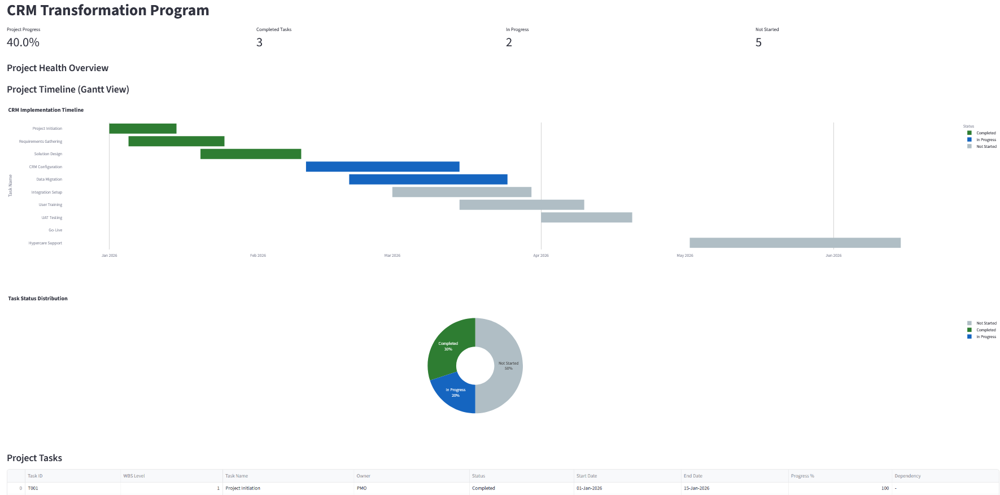

# PMO Portfolio

A collection of practical projects developed to demonstrate skills in:

- PMO Governance
- Project Reporting
- Business Process Analysis
- Requirements Gathering
- Data Analytics

---

## Project 1 – PMO Governance & Reporting Dashboard

Technologies:
- Python
- Streamlit
- Pandas
- Plotly

Key Topics:
- RAID Management
- KPI Reporting
- Gantt Charts
- Project Governance

Repository:
[PMO Dashboard](https://github.com/melmaur/PMO-Project-Dashboard)

Screenshot:
![Project 1 Dashboard] images/Dashboard_V4.png)
 

---

## Project 2 – Community Library Process Improvement

Key Topics:
- Process Mapping
- Gap Analysis
- Requirements Gathering
- Continuous Improvement

Repository:
[Process Improvement](https://github.com/melmaur/Community-Library-Process-Improvement.git)

Screenshot:

---

## Project 3 – Operational Data Analytics

Key Topics:
- SQL
- Excel
- KPI Design
- Reporting

Repository:
[Data Analytics](...)

Screenshot:

## Skills Demonstrated in each Project

|        Skill          | Project 1 | Project 2   | Project 3 |
|-----------------------|-----------|-------------|-----------|
|     PMO Reporting     |    ✓      |    x        |    ✓      |
|     RAID Management   |    ✓      |    x        |     x     |
|     Process Mapping   |     x     |    ✓        |     x     |
| Requirements Analysis |     x     |    ✓        |     x     |
|     Data Analysis     |     ✓     |    x        |     ✓     |
|     KPI Design        |     ✓     |    x        |     ✓     |
| Dashboard Development |     ✓     |    x        |     ✓     |
